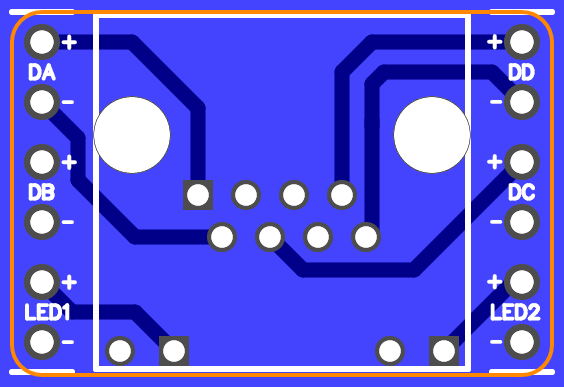

Breakout for Amphenol RJHSE-508x unshielded 8P8C jack with 2 LEDs
=================================================================

This is a design for a breakout for an Amphenol RJHSE-508x unshielded 8P8C jack with 2 LEDs.

Features
--------

*   Jack is positioned to face out of one end of a breadboard.
*   12 breadboard output pins in DIL formation with columns 800mil apart.
*   The pins for each pair are adjacent to each other.

Parts list
----------

*   1 x Amphenol RJHSE-508x
*   2 x 6-pin header (100-mil centers)

License
-------

Written in 2016 by Peter S. May

To the extent possible under law, the author(s) have dedicated all copyright and related and neighboring rights to this design data to the public domain worldwide. This design data is distributed without any warranty.

You should have received a copy of the CC0 Public Domain Dedication along with this design data. If not, see http://creativecommons.org/publicdomain/zero/1.0/.
